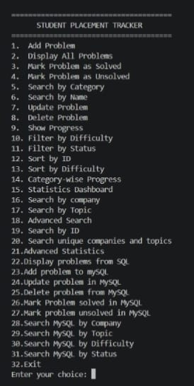
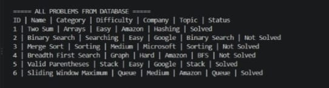
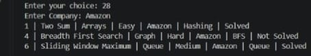

# Student Placement Tracker

A Java-based Student Placement Tracker designed to manage coding problems and placement preparation progress.

## 🚀 Features

- Add, update and delete coding problems
- Mark problems as solved/unsolved
- Search by:
  - Company
  - Topic
  - Category
  - Difficulty
  - Status
- Advanced multi-filter search
- Progress tracking
- Category-wise progress
- Statistics dashboard
- HashMap-based ID searching
- HashSet-based unique company/topic tracking
- File handling using `problems.txt`
- MySQL database integration
- JDBC CRUD operations
- JUnit testing
- Exception handling

## 📸 Screenshots

### Main Menu


### MySQL Problems


### Statistics Dashboard



## 🛠️ Technologies Used

- Java
- Object-Oriented Programming
- Data Structures
- ArrayList
- HashMap
- HashSet
- File Handling
- MySQL
- JDBC
- JUnit 5
- Git & GitHub

## 📁 Project Structure

```text
Student-Placement-Tracker/
├── src/
│   ├── Main.java
│   ├── Problem.java
│   ├── ProblemManager.java
│   ├── FileHandler.java
│   ├── DatabaseConnection.java
│   └── DatabaseManager.java
│
├── test/
│   └── ProblemTest.java
│
├── data/
│   └── problems.txt
│
├── database/
│   └── schema.sql
│
├── lib/
│   ├── mysql-connector-j-26.7.0.jar
│   └── junit-platform-console-standalone-*.jar
│
├── README.md
└── .gitignore